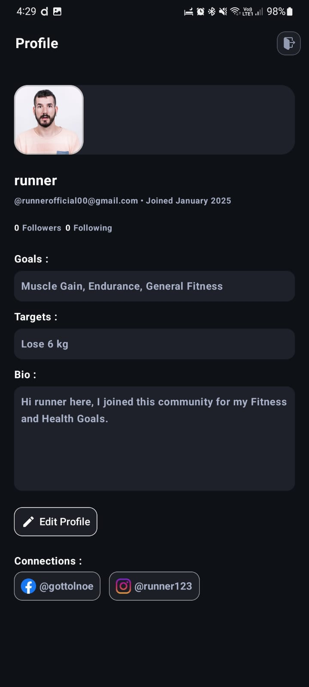

# Fitness Buddy Finder App

## Overview

The **Fitness Buddy Finder App** is a mobile application designed to connect fitness enthusiasts, whether they are looking for a workout buddy or aiming to create/manage fitness groups. The app provides experiences for both types of users, enabling efficient collaboration, real-time interactions, and personalized recommendations to meet fitness goals.

---

## Features

### 1. Authentication
- **User Sign-Up/Login Methods**:
  - Register using either via a unique email by **Google Link Email Authorization** or by **Google Oauth**.
  - Upload a **custom profile** picture or use the default avatar.
  - Choose one of two roles during sign-up:
    - **Workout Buddy**: Find compatible workout partners.
    - **Fitness Group Organizer**: Create and manage fitness groups.

- **Role-Based Onboarding**:
  - Some required details form for each category while sign-up.
  - **Workout Buddy**:
    - Enter fitness details such as goals, workout preferences, Target, and availability.
  - **Fitness Group Organizer**:
    - Provide group-specific details, including activity type, location, and schedule (editable later).
  - Location data saving for futher locating and filtering the users based on distance using Distance Matrix API.

### 2. Dashboard
- **Buddy Finder Perspective**:
  - **Recommended Buddies**: Filters workout partners based on both preferences and proximity.
  - **Available Groups**: View fitness groups also based on both preferences and proximity and navigate to group details.
  - **AI ChatBot**: Chatbot for further guidance based on the **selected goals** of user.
  - **Filters**:
    - Leverages **Distance Matrix API** for proximity-based suggestions.
  - **Fragments**:
    - **HomeFragment**: Shows posts recently posted by the users about health, redirection to their articles, Like the post.
    - **GroupFragment**: Shows all the groups which are joined or requested, users can directly access the group details like members, organizer from here.
    - **ExploreFragment**: Shows feed of buddies and Organizations by filtering them using Distance Matrix Api , (People or Groups).
    - **CreateFragment**: Allows users to create post and manage the personal users chat.
      
- **Group Organizer Perspective**:
  - Manage existing fitness groups, including editing details, member details etc.
  - Review and approve join requests from users if group is private else user can directly enter the group.

### 3. Group Page
- **Group Details**:
  - Display activity type (* To be implemented ) and a brief description.
- **Member List**:
  - Show profiles of current group members , users can see memebers profile from here also.
- **Interactions**:
  - Real-time group chat for communication with members.
- **Organizer Details**:
  - Direct contact information for the group organizer.

### 4. Profiles
- **Buddy Profile**:
  - View personal details like name, profile picture, fitness goals, bio and personal social-media connections.
  - Allows editing profile to user.
  - Contact options.

- **Group Profile**:
  - Organizer details, including banner, name, profile picture, and contact information.
  - Members and Requests.

### 5. Notification Feed
- **Buddy Finder Perspective**:
  - Get notified in real-time for:
    - Updates on join requests and group chats.

- **Group Organizer Perspective**:
  - Notifications for:
    - New join requests.
    - Updates from group chats.

- **Implementation**:
  - Notifications and Feed powered by **Firebase Cloud Messaging and Firestore snapshot listeners** respectively for real-time updates.
  - Messages and chat metadata are stored in Google Firebase Firestore.

---

## Techstacks Used

- **Frontend**: Jetpack Compose(Android)
- **Backend**: REST APIs or Firebase (for user authentication and real-time chats and Feed) and Nextjs WebServer for real-time notification feeds.
- **Real-Time Communication**: Firestore snapshot listners.
- **Proximity Suggestions**: Google Maps Distance Matrix API.

---

## How to Run the Project

  **For just testing the apk you can download the lastest release from releases section.**

1. **Clone the Repository**:
   ```bash
   git clone https://github.com/rajeev-k47/Fitbit
2. **Open project in Android Studio**:
3. **Make a file names ```apikeys.properties``` in root folder and paste your Apis like**
   ```
     G_OAUTH_WEB_SERVER_CLIENT_ID = xyz
     GENERATIVE_API_KEY = xyz
     DISTANCE_MATRIX_API_KEY = xyz
     ONESIGNAL_APP_ID = xyz
   ```
4. Sync the dependencies and Build the app. Woah!!!


## Key Features and Samples
 - **SignUp :**
   
   Login using G-oauth and fill the details according to type of work.
   
                                                                 

 - **DashBoard :**
  
  Recent posts posted by users
  
                                      

 - **Explore :**

  Filter the buddies and groups by related feed or near you category.
  
                                         

   

 - **Create Post**

    Create posts.
  
                                          

- **View and Edit Profile**

    Create posts.
  
                                          
   
- **Group page**

    View groups and its members. Group chat feature at topBar
  
                                          
   

- **Realtime Messaging**

    Realtime messaging with Notifications
  
                                

- **ChatBot**
  
   Chatbot for health guidance.
  
  
